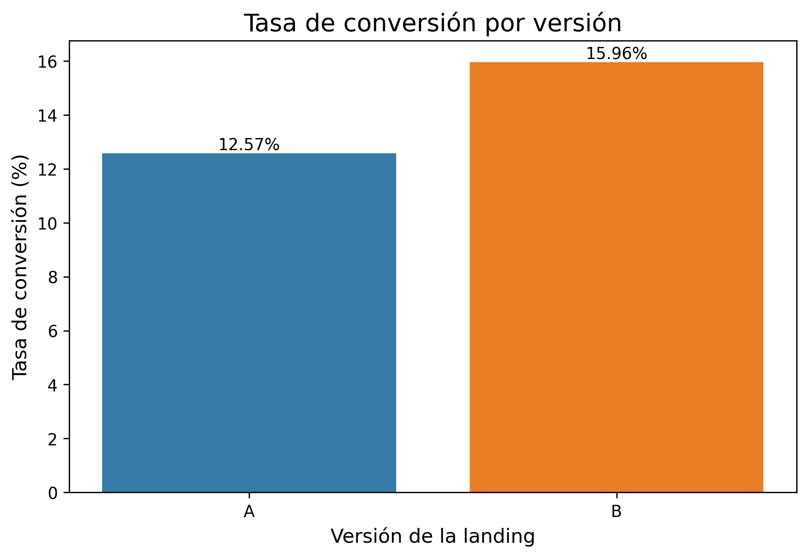
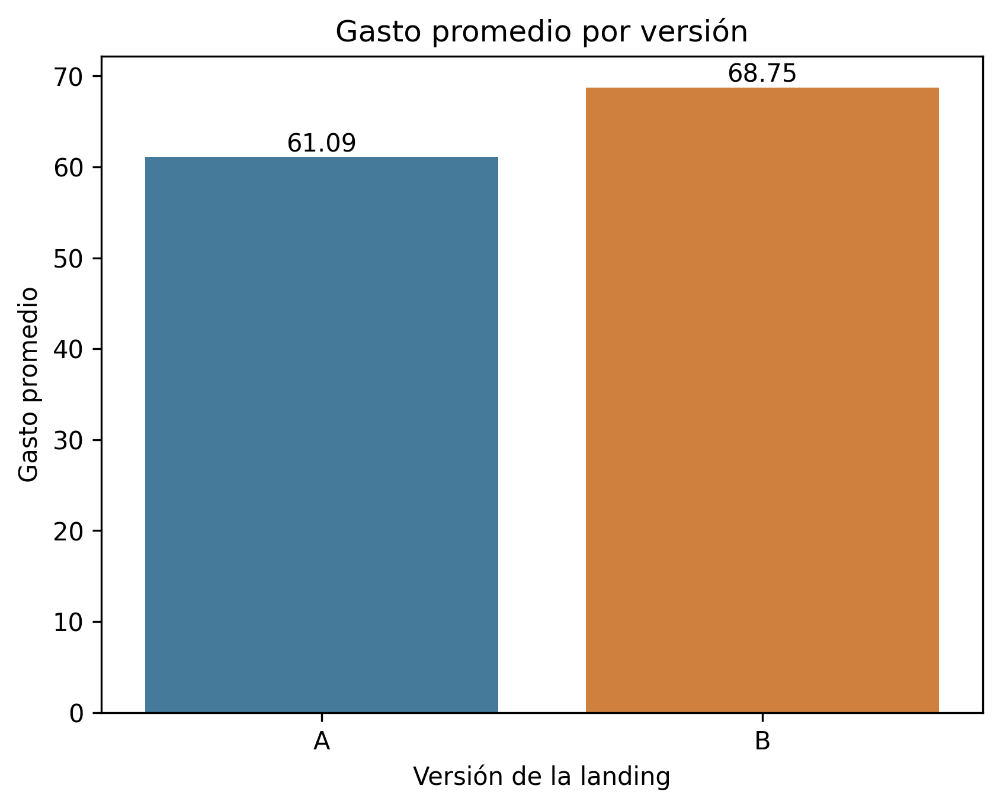
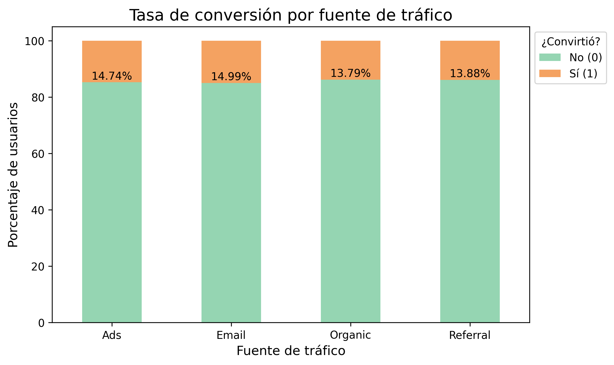

# A/B Landing Page Experiment

This project analyzes an A/B test comparing two landing page versions (A and B) for an ecommerce business. The analysis evaluates conversion rate and average spend among converted users, and explores whether conversion varies across traffic sources and user types.

> **Academic Project**
>
> This project was developed for educational purposes as part of a simulated business case. The role, business scenario, and recommendations are intended to demonstrate a data analytics workflow and should not be interpreted as official guidance for the organizations referenced.

---

## 📌 Project Overview

The analysis evaluates whether landing page version B performs better than version A in terms of conversion and average spend among converted users.

Statistical hypothesis testing and categorical analysis are used to determine whether observed differences are statistically significant and to identify relevant patterns across traffic sources and user types.

---

## 🏢 Business Context

An ecommerce company is evaluating two versions of its landing page through an A/B experiment. The goal is to determine which version should be prioritized based on its ability to generate conversions and economic value.

The analysis also examines whether conversion behavior varies by acquisition channel or user type, providing additional context for marketing and segmentation decisions.

---

## 🎯 Analysis Objective

### Main Objective

Evaluate the performance of landing page versions A and B using statistical evidence to determine whether differences in conversion and average spend are significant and identify relevant conversion patterns across user segments.

### Analysis Questions

- Does average spend among converted users differ significantly between versions A and B?
- Which landing page version generates a higher conversion rate?
- Is conversion associated with traffic source?
- Is conversion associated with user type?

---

## 📊 Data Sources

### Landing Experiment Dataset

`landing_experiment.csv` contains **40,000 user-level observations** from the A/B experiment.

Each record represents a user exposed to one landing page version and includes:

- Landing page version (A or B)
- Exposure date
- Region
- Device
- Traffic source
- User type
- Conversion status
- Spend

The dataset covers the period from **January 1 to January 28, 2026**. The experiment is approximately balanced between versions A and B, with 19,982 users assigned to A and 20,018 to B.

The `spend` variable is only greater than zero for converted users, so average spend comparisons are restricted to users who completed a conversion.

---

## 🔎 Analysis Process

- **Data validation:** Reviewed dataset structure, data types, missing values, and consistency of the experimental groups.
- **Descriptive analysis:** Compared user counts, conversion counts, conversion rates, and average spend between landing page versions.
- **Statistical testing:** Applied Levene's test and Welch's t-test for average spend, a two-proportion Z-test for conversion rates, and Chi-square tests of independence for categorical relationships.
- **Segmentation analysis:** Examined conversion behavior by traffic source and user type.
- **Visualization and interpretation:** Created comparative visualizations to support the statistical findings and translate them into business insights.

---

## 🔑 Key Findings

### 1. Version B achieved a higher conversion rate

Version B achieved a **15.96% conversion rate**, compared with **12.57% for version A**, representing a difference of **3.38 percentage points**.

The two-proportion Z-test found this difference to be statistically significant (**p < 0.001**), providing evidence that the observed difference is unlikely to be explained by random variation alone.



---

### 2. Converted users on version B spent more on average

Average spend among converted users was **68.75** for version B compared with **61.09** for version A.

Welch's t-test indicated a statistically significant difference between the two groups (**p < 0.001**).

This means version B performed better on both conversion rate and average spend among users who converted during the analyzed period.



---

### 3. Traffic source was associated with conversion

Conversion rates varied across traffic sources, ranging from **13.79% for Organic** to **14.99% for Email**.

A Chi-square test found a statistically significant association between traffic source and conversion (**p = 0.034**). However, the differences in conversion rates were relatively small, so the statistical association should not be interpreted as a large practical effect.



---

### 4. User type did not show a significant relationship with conversion

New users converted at **14.36%**, compared with **14.09%** for returning users.

The Chi-square test did not find statistically significant evidence of an association between user type and conversion (**p = 0.474**).

Therefore, the analysis does not provide sufficient evidence to justify differentiated strategies based solely on whether a user is new or returning.

---

## 💡 Recommendations

- **Prioritize version B for further evaluation or rollout**, given its statistically significant improvement in both conversion rate and average spend among converted users.
- **Continue monitoring the performance of traffic sources**, particularly Email and Ads, while investigating why their conversion rates are slightly higher than Organic and Referral.
- **Avoid segmenting users solely by user type** based on the current evidence, since new and returning users showed very similar conversion rates.
- **Repeat or extend the experiment before making a permanent implementation decision**, in order to verify that the observed advantages of version B persist beyond the analyzed period.

---

## ⚠️ Analysis Limitations

- The analysis covers a limited experimental period of **28 days**, so the results may not represent longer-term behavior.
- Average spend is calculated only among **converted users** and therefore should not be interpreted as average revenue per exposed user.
- The Chi-square analysis identifies statistical associations between categorical variables and conversion; it does not establish causal relationships for traffic source or user type.
- Traffic-source differences are statistically significant but relatively small in magnitude, so their practical business impact should be evaluated alongside additional marketing metrics.
- The project is based on an academic simulated business case, so recommendations should be validated against real operational, financial, and marketing data before implementation.

---

## 🗂️ Repository Structure

```text
analysis_landing_page_test/
├── README.md
├── analysis_landing_page_test.ipynb
├── data/
│   └── landing_experiment.csv
└──  images/
    ├── avg_spend_ab.png
    ├── conversion_rate_ab.png
    └── traffic_conversion_rate.png
```

---

## 🛠️ Tools and Technologies

- Python
- Pandas
- NumPy
- SciPy
- Statsmodels
- Seaborn
- Matplotlib
- Jupyter Notebook / Google Colab
- Git / GitHub

---

## 🔄 Reproduction Process

The notebook is configured to load the dataset directly from the repository.

[](https://colab.research.google.com/github/rojaspetit/analysis_landing_page_test/blob/main/analysis_landing_page_test.ipynb)

1. Open the notebook in Google Colab.
2. Run all cells from beginning to end.
3. The notebook clones the GitHub repository and loads `data/landing_experiment.csv`.
4. No manual dataset upload is required.
5. The analysis and visualizations are generated from the repository data.

---

## 👤 Author

**Edgar Rojas**

*Data Analytics Portfolio Project*
